# Nagar AI — Screenshots & Workflow Documentation

---

## System Overview

Nagar AI is a full-stack municipal complaint management system with 5 roles: **super_admin**, **admin**, **area_admin**, **worker**, and **citizen**. Complaints are auto-classified by AI (Groq/LLaMA) and auto-assigned to available workers.

---

## 1. Authentication Flow

### Set Password (Invite-based)

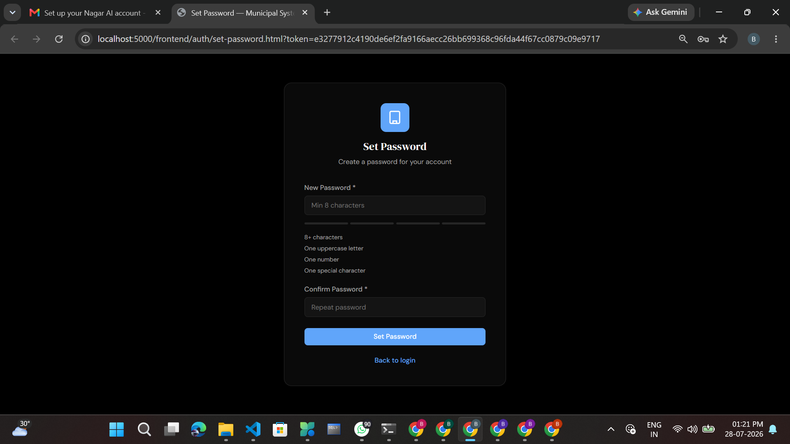

**Workflow:**
1. Admin/area_admin sends invite via email
2. Invited user receives email with a link: `/frontend/auth/set-password.html?token=...`
3. User creates password (min 8 chars, uppercase, number, special char)
4. After setting password, redirects to login page

---

## 2. Admin Portal

The **admin** manages the municipality structure: zones, wards, departments, and users.

### 2.1 Admin Dashboard

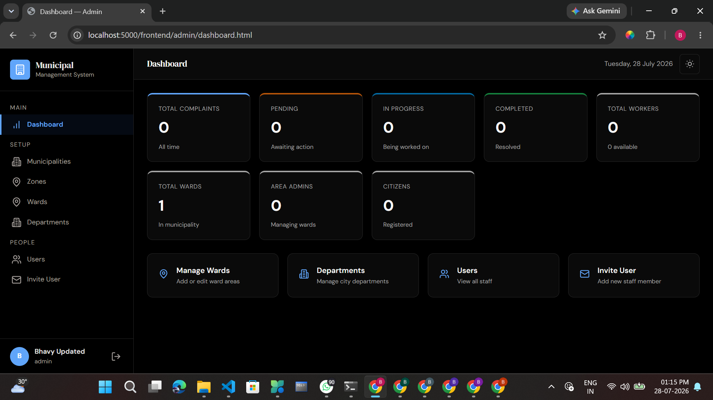

**Shows:**
- Total complaints, pending, in progress, completed
- Total workers, total wards, area admins, citizens
- Quick links: Manage Wards, Departments, Users, Invite User

**Workflow:** Admin gets an overview of the entire municipality at a glance.

---

### 2.2 Manage Zones

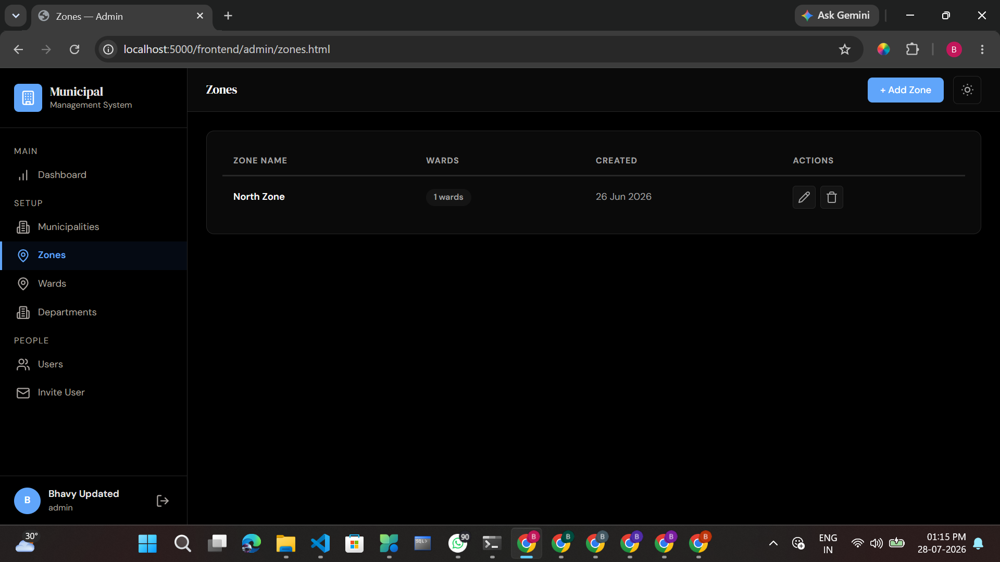

**Shows:**
- List of zones with ward count, created date
- Add, edit, delete zones

**Workflow:** When a municipality is created, 2 zones (Zone A, Zone B) are auto-created. Admin can add more.

---

### 2.3 Manage Wards

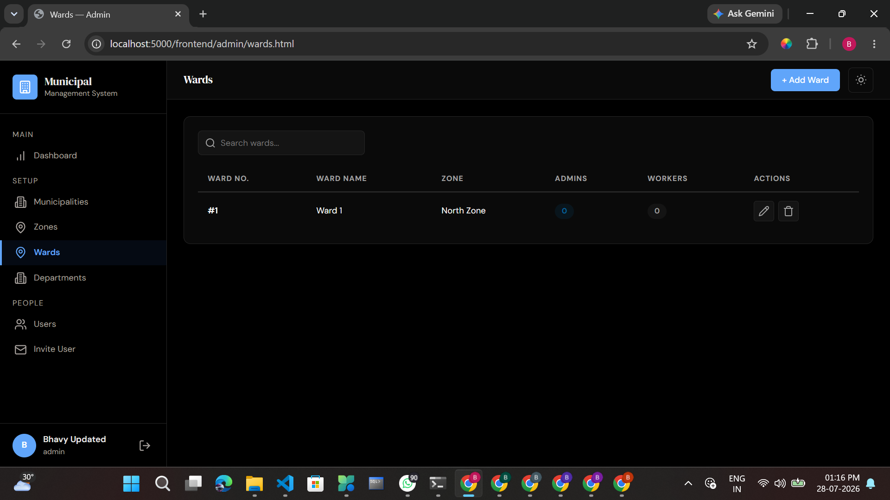

**Shows:**
- Ward number, name, zone, admin count, worker count
- Search, add, edit, delete wards

**Workflow:** When a municipality is created, 4 wards (2 per zone) are auto-created. Each ward gets an area_admin assigned.

---

### 2.4 Manage Departments

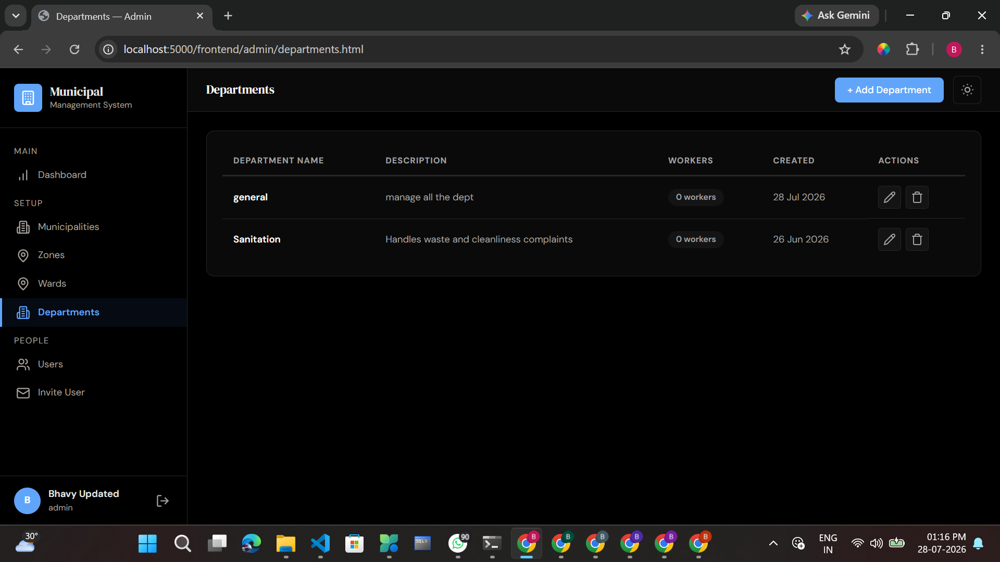

**Shows:**
- Department name, description, worker count
- Add, edit, delete departments

**Workflow:** Admin creates departments (Sanitation, Roads, Water, etc.) to categorize complaints and assign workers.

---

### 2.5 Invite User

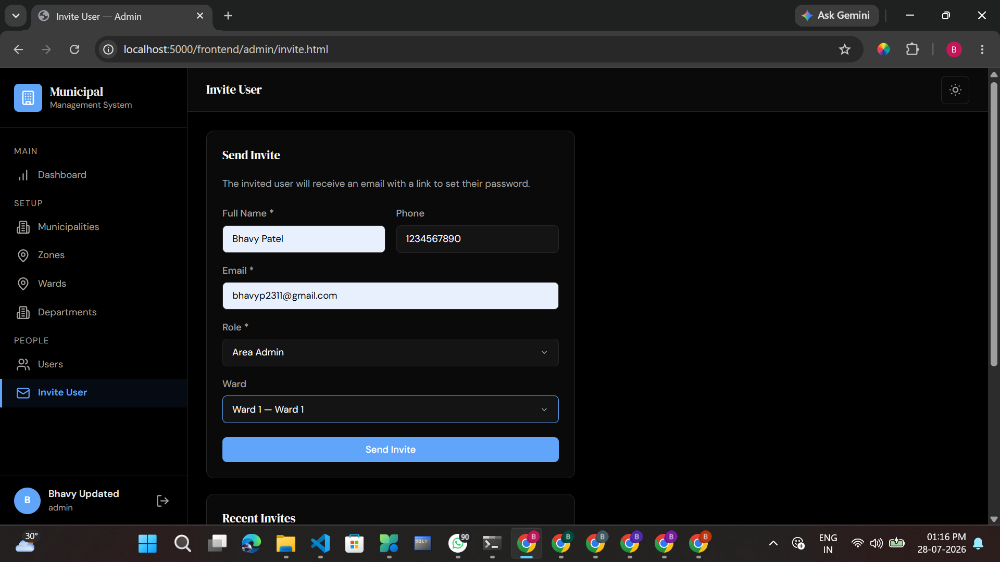

**Shows:**
- Form: Full Name, Phone, Email, Role (dropdown), Ward (dropdown)
- Send Invite button
- Recent Invites list below

**Workflow:**
1. Admin fills form and selects role (Area Admin, Worker, etc.)
2. System sends email with set-password link
3. User clicks link, sets password, can then login

---

### 2.6 Manage Users

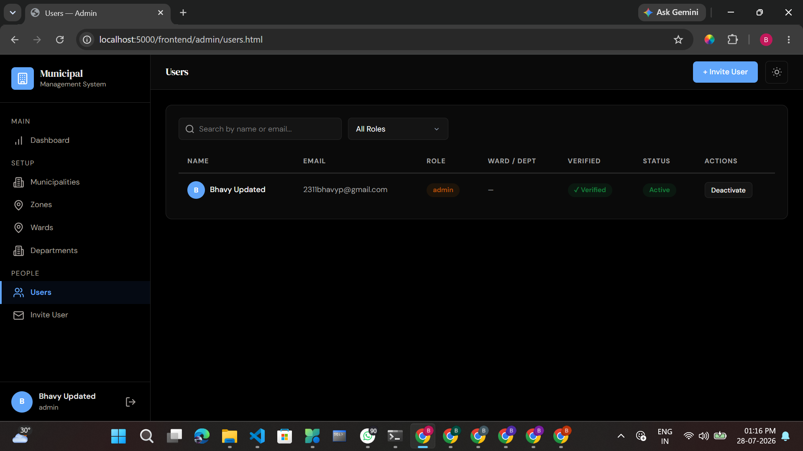

**Shows:**
- User list with Name, Email, Role, Ward/Dept, Verified status, Status
- Search by name/email, filter by role
- Activate/Deactivate toggle

**Workflow:** Admin can view all users, activate or deactivate accounts.

---

## 3. Area Admin Portal

The **area_admin** manages complaints and workers in their assigned ward.

### 3.1 Area Admin Dashboard

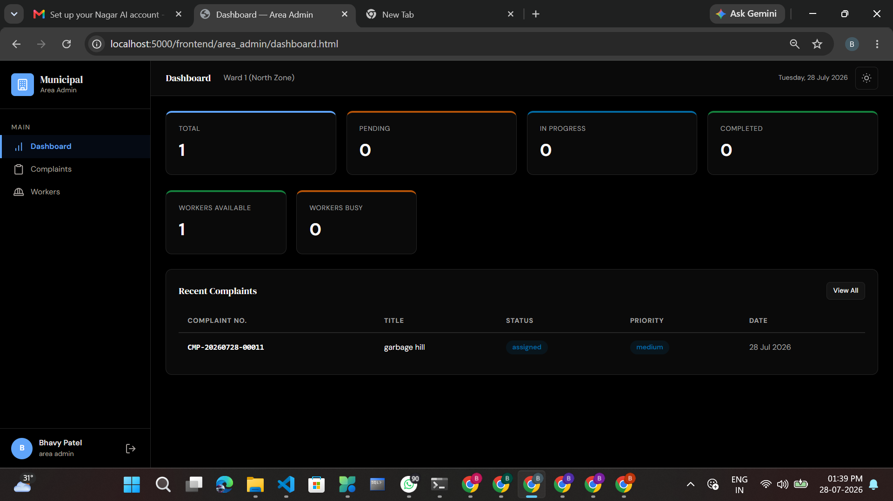

**Shows:**
- Ward info: "Ward 1 (North Zone)"
- Total complaints, pending, in progress, completed
- Workers available, workers busy
- Recent complaints table

**Workflow:** Area admin monitors their ward's complaint status and worker availability.

---

### 3.2 Ward Complaints

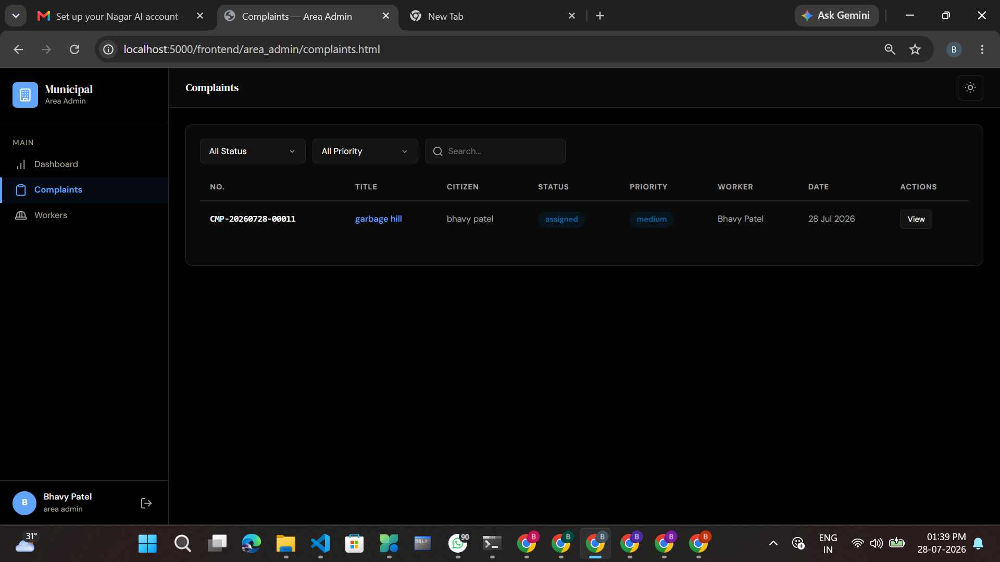

**Shows:**
- Complaint list with No., Title, Citizen, Status, Priority, Worker, Date
- Filter by status, priority, search
- View action button

**Workflow:** Area admin views all complaints in their ward, can filter and assign workers.

---

### 3.3 Manage Workers

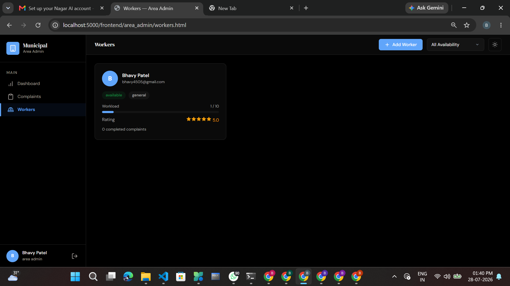

**Shows:**
- Worker cards with name, email, availability badge, department
- Workload progress bar (e.g., 1/10)
- Star rating (5.0)
- Completed complaints count
- "+ Add Worker" button

**Workflow:**
1. Area admin can add workers directly to their ward
2. Can filter by availability (available, busy, off duty)
3. Worker workload and rating are tracked

---

## 4. Citizen Portal

The **citizen** submits complaints and tracks their resolution.

### 4.1 Citizen Dashboard

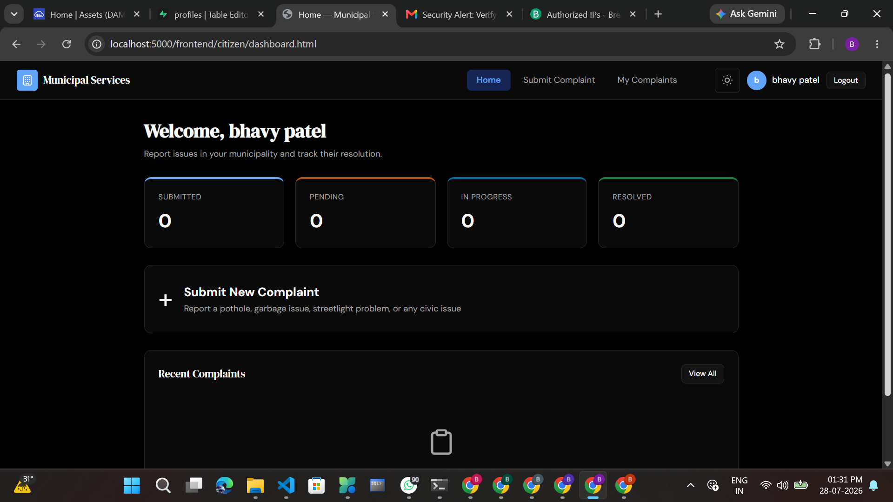

**Shows:**
- Welcome message with user name
- Stats: Submitted, Pending, In Progress, Resolved
- "Submit New Complaint" card
- Recent complaints list

**Workflow:** Citizen lands here after login, can quickly submit a new complaint or view existing ones.

---

### 4.2 Submit Complaint — Step 1: Details

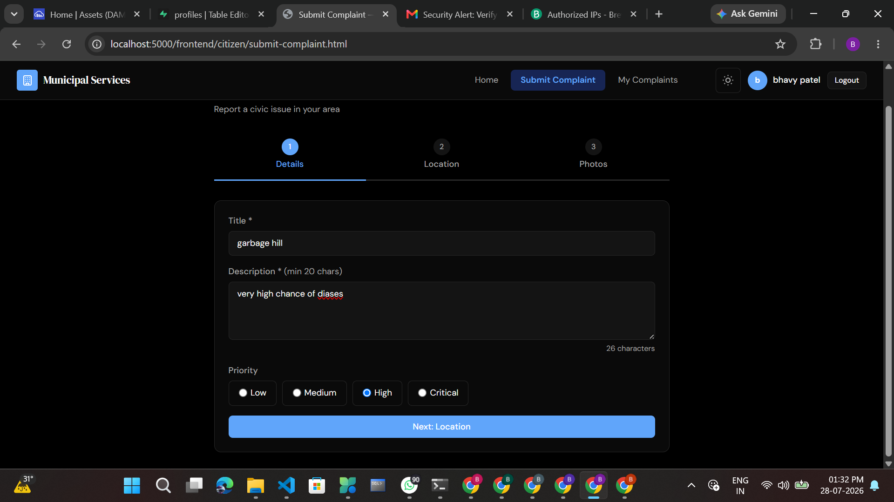

**Shows:**
- 3-step wizard: Details > Location > Photos
- Title field
- Description field (min 20 chars)
- Priority selector: Low, Medium, High, Critical
- "Next: Location" button

**Workflow:** Citizen fills in complaint details and selects priority.

---

### 4.3 Submit Complaint — Step 2: Location

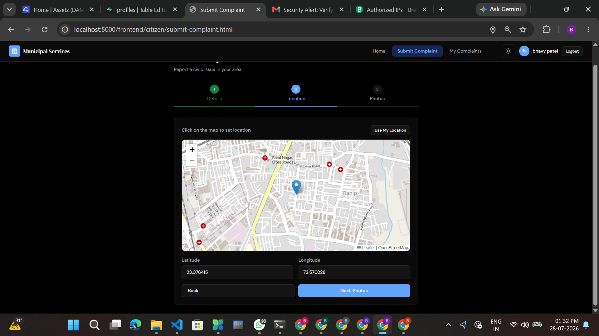

**Shows:**
- Interactive Leaflet/OpenStreetMap
- Click on map to set location
- "Use My Location" button (GPS)
- Auto-filled Latitude/Longitude
- Back and "Next: Photos" buttons

**Workflow:**
1. Citizen clicks on map or uses GPS to set complaint location
2. System uses PostGIS to detect which ward the location falls in
3. Auto-assigns complaint to a worker in that ward

---

### 4.4 Submit Complaint — Step 3: Photos

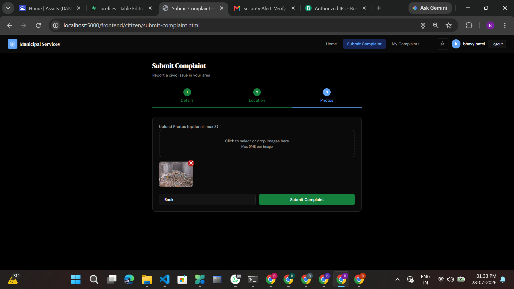

**Shows:**
- Upload Photos area (optional, max 3, max 5MB each)
- Image preview with remove button
- Back and "Submit Complaint" buttons

**Workflow:**
1. Citizen uploads optional photos
2. Clicks "Submit Complaint"
3. System creates complaint, auto-detects ward, auto-assigns to available worker
4. AI classifies category, priority, department in background

---

### 4.5 My Complaints (Citizen)

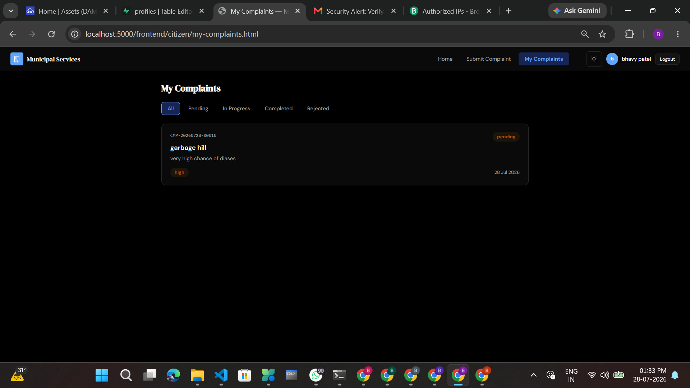

**Shows:**
- Filter tabs: All, Pending, In Progress, Completed, Rejected
- Complaint cards with: Complaint No., Title, Description, Priority badge, Status badge, Date

**Workflow:** Citizen tracks all their complaints and their current status.

---

## 5. Worker Portal

The **worker** accepts, works on, and completes assigned complaints.

### 5.1 Worker Dashboard

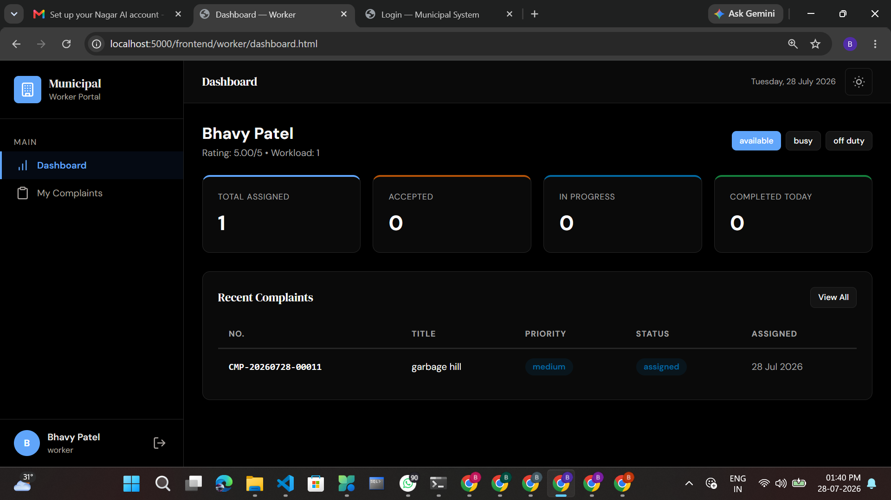

**Shows:**
- Worker name, rating (5.00/5), workload (1)
- Availability toggle: available, busy, off duty
- Stats: Total Assigned, Accepted, In Progress, Completed Today
- Recent complaints table

**Workflow:** Worker sees their assignment overview and can toggle availability.

---

### 5.2 My Complaints (Worker)

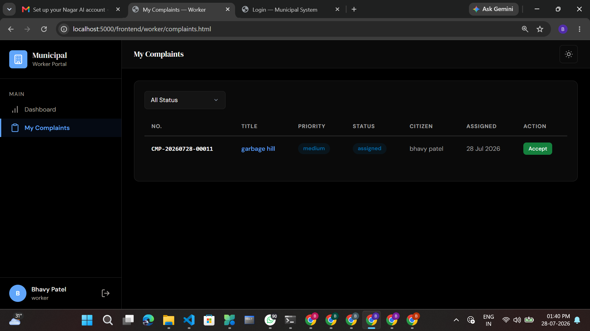

**Shows:**
- Complaint list with No., Title, Priority, Status, Citizen, Assigned date
- "Accept" button for assigned complaints
- Filter by status

**Workflow:**
1. Worker sees complaints assigned to them
2. Clicks "Accept" to accept the complaint
3. Status changes from "assigned" to "accepted"

---

### 5.3 Complaint Detail — Upload Image

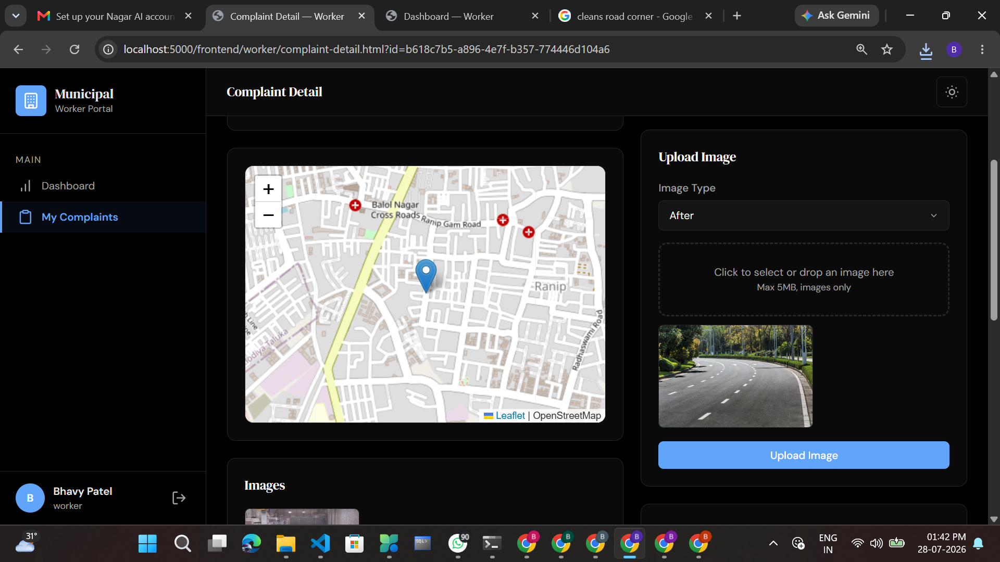

**Shows:**
- Complaint detail with Leaflet map showing location
- Upload Image panel: Image Type (Progress/After), file selector
- Image preview
- "Upload Image" button
- Existing images section below

**Workflow:**
1. Worker views complaint location on map
2. Uploads progress/after images
3. After uploading at least one image, can mark as complete

---

### 5.4 Complaint Completed

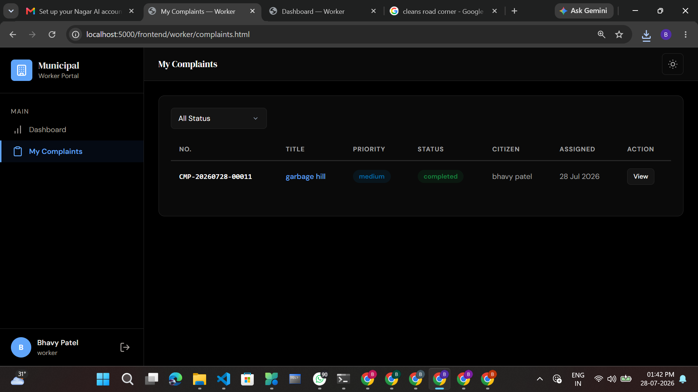

**Shows:**
- My Complaints list with status "completed" (green badge)
- "View" button

**Workflow:** After worker marks complete, complaint status changes to "completed". Area admin can then verify.

---

## 6. Full Complaint Lifecycle

```
Citizen submits complaint
        │
        ▼
   ┌─────────┐     PostGIS detects ward
   │ pending  │     AI classifies category + priority
   └────┬────┘
        │
   Auto-assigned to available worker (lowest workload)
        │
        ▼
   ┌──────────┐
   │ assigned  │ ◄── Worker sees "Accept" button
   └────┬─────┘
        │
   Worker clicks Accept
        │
        ▼
   ┌──────────┐
   │ accepted  │ ◄── Worker sees "Start Working" button
   └────┬─────┘
        │
   Worker clicks Start
        │
        ▼
   ┌──────────────┐
   │ in_progress   │ ◄── Upload card appears
   └────┬─────────┘
        │
   Upload image(s) + Click "Mark as Complete"
        │
        ▼
   ┌───────────┐
   │ completed  │ ◄── Requires at least 1 image
   └────┬──────┘
        │
   Area admin verifies
        │
        ▼
   ┌───────────┐
   │  verified  │
   └────┬──────┘
        │
   Auto-close or manual close
        │
        ▼
   ┌─────────┐
   │  closed  │
   └─────────┘
```

---

## 7. Key Features

| Feature | Description |
|---|---|
| **Auto-Assignment** | Complaints auto-assign to available worker with lowest workload |
| **AI Classification** | Groq API (LLaMA 3) classifies category, priority, department |
| **PostGIS Ward Detection** | GPS coordinates auto-detect which ward the complaint belongs to |
| **Image Requirement** | Worker must upload at least 1 image before completing |
| **Municipality Auto-Division** | New municipality auto-creates 2 zones + 4 wards |
| **Worker Auto-Add** | Area admin can add workers directly to their ward |
| **Dark/Light Theme** | Toggle between pure black dark theme and white light theme |
| **Responsive Design** | Hamburger menu, collapsing grids for mobile |

---

## 8. Tech Stack

| Layer | Technology |
|---|---|
| Frontend | HTML5, CSS3, Vanilla JS |
| Backend | Node.js + Express 5 (ES Modules) |
| Database | PostgreSQL via Supabase (PostGIS) |
| Auth | JWT (access + refresh tokens) |
| AI | Groq API (llama-3.3-70b-versatile) |
| Images | Cloudinary |
| Email | Brevo (Sendinblue) |
| Fonts | DM Serif Display + DM Sans |
| Icons | Inline SVG |
| Maps | Leaflet + OpenStreetMap |

---

*Generated: 28 July 2026*
